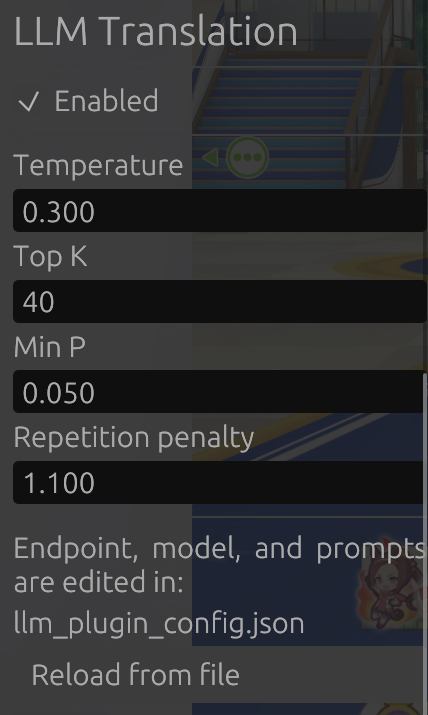

# LLM-Plugin
An LLM-based auto-translation plugin for Hachimi-Edge for JP Honse Game

## Acknowledgements
This plugin practically reimplements the Auto Translate feature in hachimi, targeting LLMs instead of Sugoi offline  
Also reimplements the synchronous thread blocking behaviour during translation present in Hachimi-Edge versions prior to V0.26.0  
This is primarily due to the new behaviour being prone to crashes  
> This plugin requires a hachimi version with API v3 (basically latest and you'll be fine)

## Features
- Translate stories and event dialogues using LLMs  
- Compatible with LM Studio

## Usage/Installation
Requires Hachimi-Edge to be installed  
Most importantly LM Studio
Download the latest `llm_plugin.dll` from [releases](https://github.com/Warspoot/LLM-Plugin/releases/latest)  
Navigate to game install and place the plugin inside the `hachimi` folder  
in `hachimi/config.json` edit the following line:
```json
  "load_libraries": [],
```
to:
```json
  "load_libraries": [
    "hachimi//llm_plugin.dll"
  ],
```
If done correctly you should see an LLM Translation section in the hachimi GUI  
  
> By default the LLM Translation feature is on, but you can turn it off from the GUI.

### Plugin Config & Behaviour
The plugins settings are created and saved at `hachimi/llm_plugin_config.json`  
The default parameters for the plugin are: 
```json
{
  "enabled": true,
  "endpoint": "http://127.0.0.1:1234/v1/chat/completions",
  "model": "model",
  "system_prompt": "Translate the following Japanese dialogue into natural English. Reply with only the translation, no notes or explanation.",
  "name_prompt": "This is a character's name from a Japanese video game, often a real racehorse's name written in katakana. Respond with only its standard English transliteration - no notes, no punctuation, no quotation marks.",
  "temperature": 0.3,
  "top_k": 40,
  "min_p": 0.05,
  "repetition_penalty": 1.1
}
```
Most of these settings are self explanatory, with the two main ones being `endpoint` and `model`. Set them up accordingly to your LM Studio/OpenAI compatible setup.  
> `endpoint` requires the full url with `v1/chat/completions` placed at the end of the url.

I would also recommend changing the prompts to something else if your model seems to struggle or generates useless jargon.  

Any translations made by this plugin are found at `hachimi/localized_data/assets/llm_cache/` in unity name format (i was too lazy to reimplement hachimi's method)  

Currently incompatible with endpoints that use api keys because i am a lazy bum to include the api key in the request